## Tugas 5 Network Programming 2019

### Member
- Faizal Khilmi Muzakki 05111640000120
- Marde Fasma Ul'Aza 05111640000046
- M Hazdi Kurniawan 05111640000072

### Assignment Description
1. Implementasikan method POST, HEAD dan OPTIONS untuk program web server,  synchronous dan asynchronous
2. Lakukan performance testing dengan tools apache-benchmark, dengan jumlah request bertingkat dari 10, 50, 100, … 20000, dengan konkurensi bertingkat juga mulai 1 sampai x
3. Bandingkan antar 2 model tadi, dalam hal kemampuan melayani
4. Buatlah sebuah program load balancer (dari contoh yang ada), untuk meningkatkan kemampuan system melayani lebih banyak request dan konkurensi
5. Jalankan load balancer dan jalankan server di beberapa server yang berbeda untuk menjalankan kembali performance testing seperti pada poin 2
6. Bandingkan kembali hasilnya

### Usage
#### Without Load Balancer
- Thread
    - `python server_thread_http.py`

- Async
    - `python server_async_http.py`

#### With Load Balancer
- Thread
    - `bash thread.sh`

- Async
    - `bash async.sh`

- Load Balancer
    - on another terminal => `python load_balancing.py`

#### How to Test

- Testing
    - on another terminal => `ab -m [method] -n [n_request] -c [concurrency level] url`
    - CAUTION: if you test web server with load balancer, configure your url to you load balancer running port.

#### Documentation
- Async
    - Withouth Load Balancer
        - n = 20000, c = 20
        
        - n = 20000, c = 50
        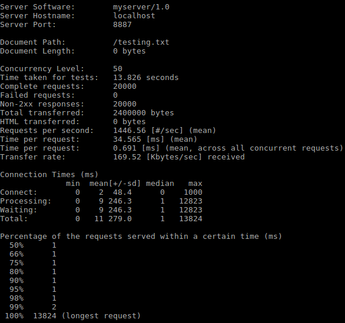
        - n = 20000, c = 100
        
        - n = 20000, c = 120
        
        - n = 20000, c = 130
        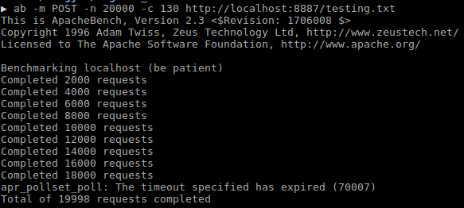

    - With Load Balancer
        - n = 20000, c = 20
        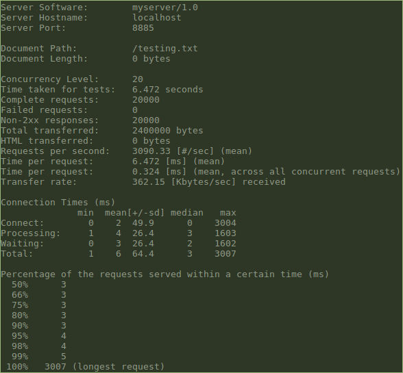
        - n = 20000, c = 50
        
        - n = 20000, c = 90
        
        - n = 20000, c = 100
        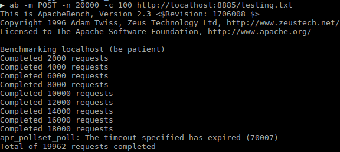
- Thread
    - HEAD Method
        - n = 20000, c = 1
        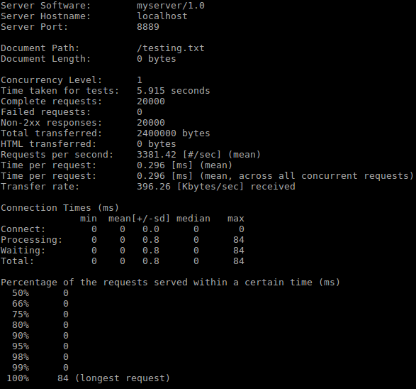
        - n = 20000, c = 12
        
        - n = 20000, c = 15
        
        - n = 20000, c = 17
        
    - POST Method
        - n = 10, c = 1
        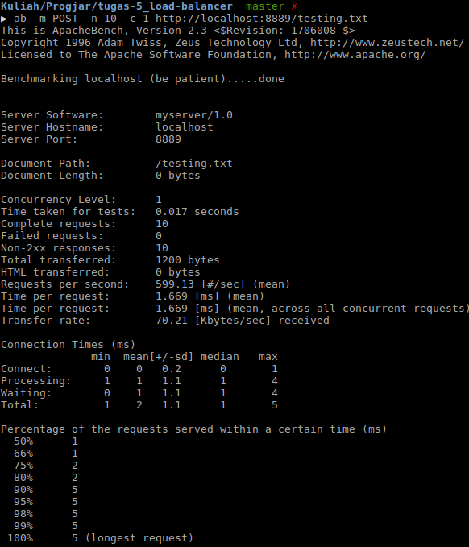
        - n = 50, c = 1
        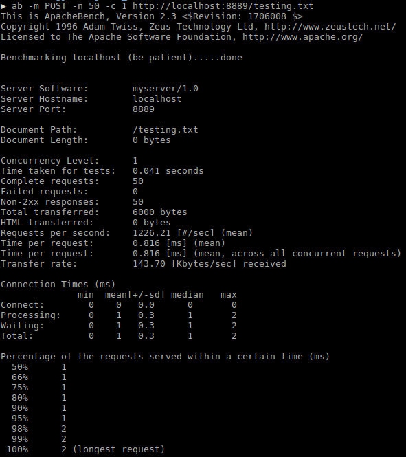
        - n = 100, c = 1
        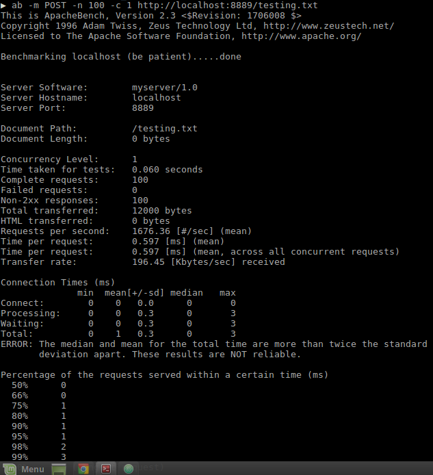
        - n = 20000, c = 1
        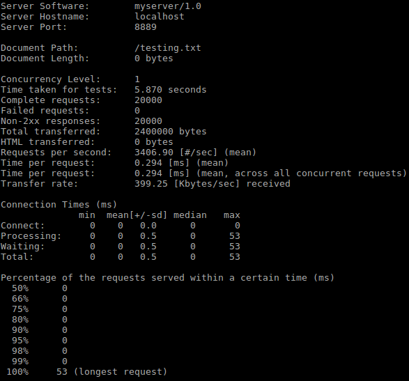
        - n = 20000, c = 20
        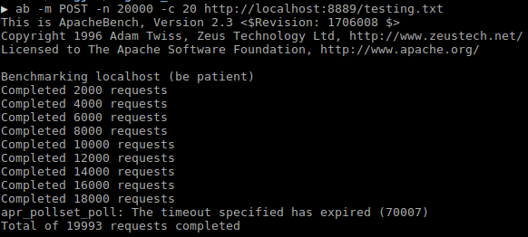
    - OPTIONS Method
        - n = 20000, c = 1
        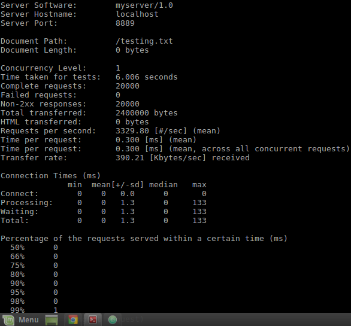
        - n = 20000, c = 10
        
        - n = 20000, c = 15
        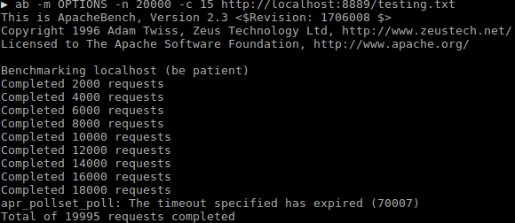
        - n = 20000, c = 20
        
        - n = 20000, c = 50
        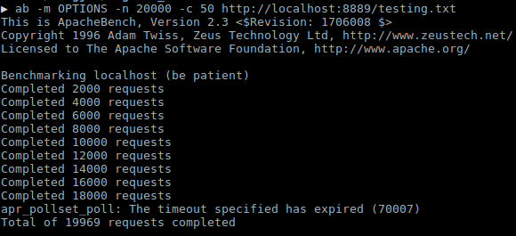
        - n = 20000, c = 100
        
